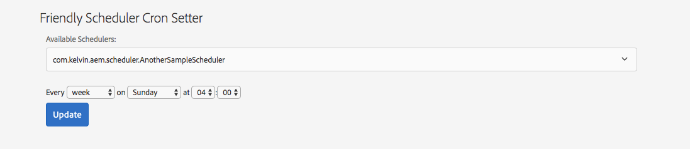

# Friendly AEM Scheduler Cron Setter

Changing ``scheduler.expression`` of an AEM/Sling scheduler usually is an admin or developer's task. For some occasions, the scheduler might be owned by content authors who want to set/change the scheduling by themselves. Even though content authors may get authorized to use crx/de or web console to set it, figuring out the correct cron expression is not easy. This utility provides a friendly UI for content authors to set the scheduling.

  

## Features

* jQury based quartz cron generator (by [jquery-cron](https://github.com/felixruponen/jquery-cron))
* Resource based access that can be permissioned for certain users
* Auto detecting and pulling existing schedulers within current or specified bundle(s)

## Dependencies

* AEM 6.3 and up (6.2 and 6.1 should also work)
* acs-aem-commons-content 3.14.10 and up (the acs-aem-commons-content subPackage is [commented out](ui.apps/pom.xml#L135), but you can uncomment to deploy it along with this package if needed)

## Building

This project uses Maven for building. Common commands:

From the root directory, run ``mvn -PautoInstallPackage clean install`` to build the bundle and content package and install to a AEM instance.

From the bundle directory, run ``mvn -PautoInstallBundle clean install`` to build *just* the bundle and install to a CQ instance.

Access http://localhost:4502/etc/friendly-cron/cron-setter.html after successful build.

## A few things to note

* By using this friendly setter, you are delegating this tool to set the configuration, which is equivalent of setting it via web console.
* For the shcedulers being set by this tool, run mode osgi config that comes with code package should be avoided (except the initial setting with vault filter [mode="merge"](ui.apps/src/main/content/META-INF/vault/filter.xml#L5)) otherwise the configuration set by this tool might get overridden.
* How to set other properties of the scheduler if needed
  * Use web console if possible
  * Extend this tool to bring other properties to the UI for setting

## Resource properties

There are a couple of **optional** [resource properties](ui.apps/src/main/content/jcr_root/etc/friendly-cron/cron-setter/.content.xml)

* ``bundlePrefix``:  bundle symbolic name prefixes. This tool will only list the schedulers under the bundles that with the names starting with the prefixes. Current bundle will be used if not specified.
* ``schedulerPIDPrefix``: scheduler PID prefixes. This tool will only list the schedulers with the PIDs starting with the prefixes. All schedulers will be listed if not specified (subject to ``bundlePrefix`` setting).
